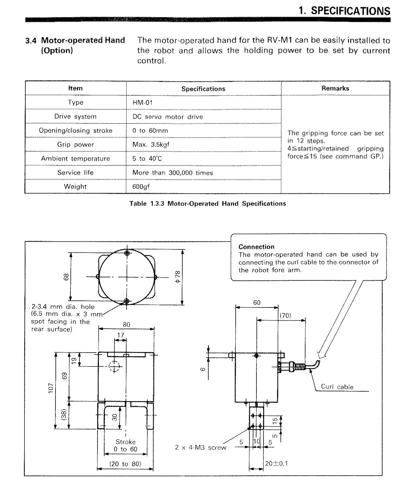
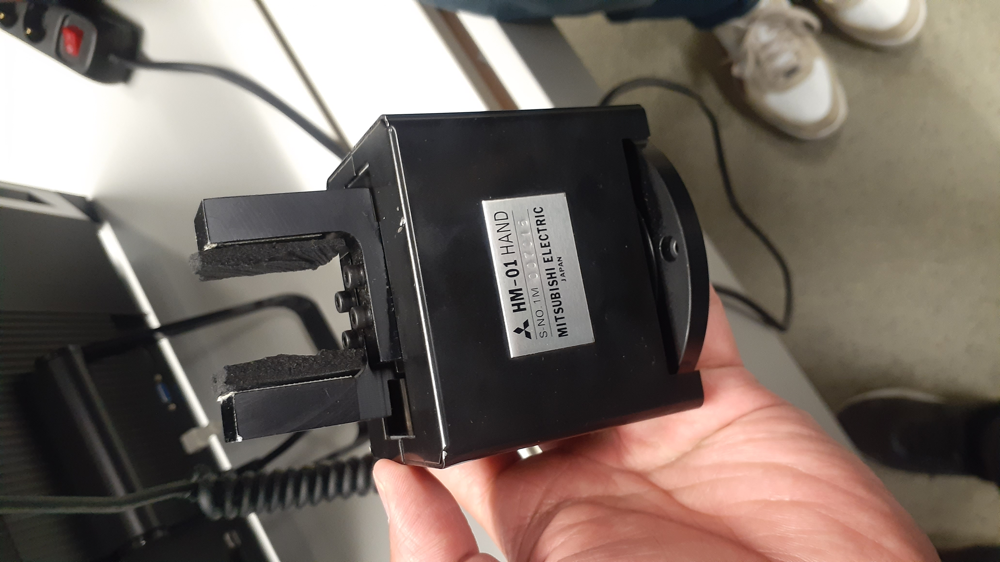
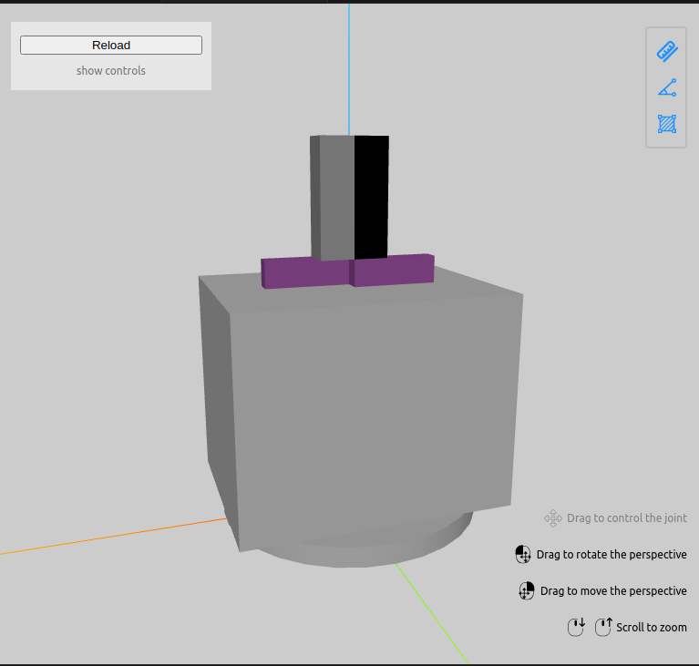
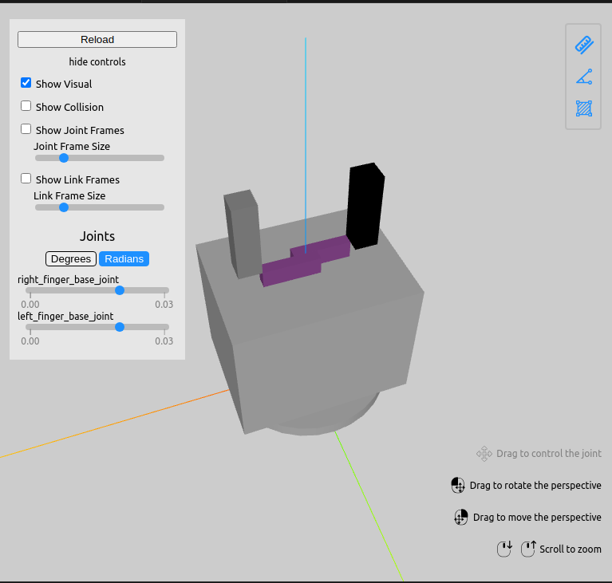

# gripper_mitsubishi_HM
Custom gripper model made for mitsubishi HM gripper. This gripper is used with igues rebel robotic arm for [ESD master project](https://github.com/KurejiMilan/igus_6dof_robotic_arm).

## Table of Contents
1. [URDF explanation](#URDF_explanation)
    1. [Gipper links](#Links_for_gripper)
2. [Images](#images)
3. [tensor_inertia.py](#tensor_inertia.py)
    1. [available geometry shapes](#available_geometry_shapes)
    2. [missing geometry shapes](#missing_geometry_shapes)
4. [Inertia Tensor Calculation Reference](#Inertia_Tensor_Calculation_Reference)
5. [Contributors](#contributors)
6. [Contacts](#contacts)
## URDF_explanation
Following link makes up the __Mitsubishi HM gripper__.
### Links_for_gripper
- base link (cylinder)
- first link (box)
- left finger base(box)
- right finger base(box)
- left finger(box)
- right finger(box)
## Images

## tensor_inertia.py
This python script calculates the inertia tensor for objects. This is done to include in interia tag which is necessary for correct simulation.
### available_geometry_shapes
- [x] **Cylinder**
- [x] **Box**

### missing_geometry_shapes
- [ ] *Sphare*

## Inertia_Tensor_Calculation_Reference
The reference calculation used for calculation of interia tensor can be found in the wiki page.
[wiki link](https://en.wikipedia.org/wiki/List_of_moments_of_inertia)

## Contributors
- [@KurejiMilan](https://github.com/KurejiMilan)
## Contacts
[milan.rai.kos@gmail.com](mailto:milan.rai.kos@gmail.com)